# 📊 Rapport d'Architecture Applicative (Statique & Dynamique)

*Généré le 2026-06-16 18:01:59*

## 📈 Statistiques Globales du Graphe
| Élément | Quantité | Description |
| :--- | :--- | :--- |
| `CALLS` | 1794 | Appels de fonctions statiques |
| `CALLS_GOOGLE` | 16 |  |
| `CONTAINS` | 269 |  |
| `DEFINES` | 1152 |  |
| `DYNAMIC_DB_CALL` | 11 |  |
| `DYNAMIC_GOOGLE_CALL` | 4 |  |
| `DYNAMIC_PUBSUB_CALL` | 1 |  |
| `DYNAMIC_SERVICE_CALLS` | 14 | Liaisons HTTP réelles détectées dans Cloud Trace (production) |
| `Database` | 3 |  |
| `Function` | 1152 | Fonctions Python déclarées |
| `GoogleService` | 3 |  |
| `HTTP_CALLS` | 100 | Appels HTTP statiques inter-services détectés dans le code |
| `Module` | 269 | Fichiers Python analysés |
| `PUBLISHES_TO` | 2 |  |
| `PubSubTopic` | 4 |  |
| `SERVICE_CALLS` | 31 | Liaisons logiques inter-services (théoriques) |
| `SUBSCRIBES_TO` | 4 |  |
| `Service` | 16 | Nombre de microservices |
| `TERRAFORM_LINK` | 111 | Liaisons d'infrastructure configurées par Terraform |
| `USES_DB` | 26 |  |

## 🗺️ Cartographie Globale (Big Picture)
Cette vue unifiée fusionne les liaisons d'infrastructure déclarées par Terraform (pointillés `-.->`), les appels statiques de l'analyse de code (flèches standard `-->`) et les flux de requêtes réels capturés par Cloud Trace (flèches épaisses `==>`).

```mermaid
graph TD
    subgraph GATEWAY["1. Clients & Passerelle (Gateway)"]
        agent_router_api[agent_router_api]:::gateway_style
    end
    subgraph AGENTS["2. Agents d'Orchestration IA"]
        agent_commons[agent_commons]:::agent
        agent_hr_api[agent_hr_api]:::agent
        agent_missions_api[agent_missions_api]:::agent
        agent_ops_api[agent_ops_api]:::agent
    end
    subgraph CORE["3. APIs de Données & Services Core"]
        competencies_api[competencies_api]:::core
        cv_api[cv_api]:::core
        drive_api[drive_api]:::core
        items_api[items_api]:::core
        missions_api[missions_api]:::core
        prompts_api[prompts_api]:::core
        shared[shared]:::core
        users_api[users_api]:::core
    end
    subgraph MCP["4. MCP Standalone & Observabilité"]
        analytics_mcp[analytics_mcp]:::mcp
        monitoring_mcp[monitoring_mcp]:::mcp
    end
    subgraph PUBSUB["5. Transport Asynchrone (Pub/Sub)"]
        cv_import_events["Topic: cv-import-events"]:::pubsub_style
        data_quality_events["Topic: data-quality-events"]:::pubsub_style
        data_quality_snapshot["Topic: data-quality-snapshot"]:::pubsub_style
        user_events["Topic: user-events"]:::pubsub_style
    end
    subgraph INFRA["6. Stockage de Données & APIs Externes (GCP)"]
        AlloyDB[("AlloyDB")]:::db_style
        BigQuery[("BigQuery")]:::db_style
        Gemini_API["☁️ Gemini API"]:::google_style
        Google_Drive_API["☁️ Google Drive API"]:::google_style
        Google_OAuth["☁️ Google OAuth"]:::google_style
        Redis[("Redis")]:::db_style
    end
    agent_commons -->|"Appelle [AST]"| Gemini_API
    agent_commons -->|"Stocke [AST]"| Redis
    agent_commons -->|"Code [AST]"| analytics_mcp
    agent_commons -->|"Code [AST]"| prompts_api
    agent_hr_api -->|"Appelle [AST+TF]"| Gemini_API
    agent_hr_api -.->|"Appelle [TF]"| Google_Drive_API
    agent_hr_api -->|"Stocke [AST+TF]"| Redis
    agent_hr_api -.->|"Infra [TF]"| analytics_mcp
    agent_hr_api -.->|"Infra [TF]"| competencies_api
    agent_hr_api -.->|"Infra [TF]"| cv_api
    agent_hr_api -.->|"Infra [TF]"| drive_api
    agent_hr_api -.->|"Infra [TF]"| items_api
    agent_hr_api -.->|"Infra [TF]"| missions_api
    agent_hr_api -.->|"Infra [TF]"| monitoring_mcp
    agent_hr_api -.->|"Infra [TF]"| prompts_api
    agent_hr_api -.->|"Infra [TF]"| users_api
    agent_missions_api -->|"Appelle [AST+TF]"| Gemini_API
    agent_missions_api -->|"Stocke [AST+TF]"| Redis
    agent_missions_api -.->|"Infra [TF]"| analytics_mcp
    agent_missions_api -.->|"Infra [TF]"| competencies_api
    agent_missions_api -.->|"Infra [TF]"| cv_api
    agent_missions_api -.->|"Infra [TF]"| missions_api
    agent_missions_api -.->|"Infra [TF]"| monitoring_mcp
    agent_missions_api -.->|"Infra [TF]"| prompts_api
    agent_missions_api -.->|"Infra [TF]"| users_api
    agent_ops_api -->|"Appelle [AST+TF]"| Gemini_API
    agent_ops_api -.->|"Appelle [TF]"| Google_Drive_API
    agent_ops_api ==>|"35 req, 1.4ms (Cache) [AST+TF]"| Redis
    agent_ops_api ==>|"3 req, 433.3ms [AST+TF]"| analytics_mcp
    agent_ops_api -.->|"Infra [TF]"| competencies_api
    agent_ops_api -.->|"Infra [TF]"| cv_api
    agent_ops_api ==>|"1 req, 1050.3ms [TF]"| drive_api
    agent_ops_api -.->|"Infra [TF]"| items_api
    agent_ops_api -.->|"Infra [TF]"| missions_api
    agent_ops_api ==>|"4 req, 7874.4ms [TF]"| monitoring_mcp
    agent_ops_api ==>|"3 req, 6458.2ms [TF]"| prompts_api
    agent_ops_api -.->|"Infra [TF]"| users_api
    agent_router_api -->|"Appelle [AST+TF]"| Gemini_API
    agent_router_api -.->|"Appelle [TF]"| Google_Drive_API
    agent_router_api ==>|"1 req, 6.2ms (Cache) [AST+TF]"| Redis
    agent_router_api -.->|"Infra [TF]"| agent_hr_api
    agent_router_api -.->|"Infra [TF]"| agent_missions_api
    agent_router_api -.->|"Infra [TF]"| agent_ops_api
    agent_router_api -->|"Code [AST+TF]"| analytics_mcp
    agent_router_api -.->|"Infra [TF]"| competencies_api
    agent_router_api -.->|"Infra [TF]"| cv_api
    agent_router_api -.->|"Infra [TF]"| drive_api
    agent_router_api -.->|"Infra [TF]"| items_api
    agent_router_api -.->|"Infra [TF]"| missions_api
    agent_router_api -.->|"Infra [TF]"| monitoring_mcp
    agent_router_api -.->|"Infra [TF]"| prompts_api
    agent_router_api -->|"Code [AST+TF]"| users_api
    analytics_mcp ==>|"27 req, 274.6ms (Analytics) [AST]"| BigQuery
    analytics_mcp -->|"Stocke [AST+TF]"| Redis
    analytics_mcp -.->|"Infra [TF]"| prompts_api
    analytics_mcp -->|"Code [AST+TF]"| users_api
    competencies_api ==>|"302 req, 27.5ms (SQL) [AST+TF]"| AlloyDB
    competencies_api ==>|"3 req, 863.3ms (API) [AST+TF]"| Gemini_API
    competencies_api ==>|"315 req, 2.1ms (Cache) [AST+TF]"| Redis
    competencies_api -->|"Code [AST]"| analytics_mcp
    competencies_api -.->|"Infra [TF]"| competencies_api
    competencies_api ==>|"3 req, 32.2ms [AST+TF]"| cv_api
    competencies_api -->|"Code [AST+TF]"| prompts_api
    competencies_api -->|"Abonné /pubsub/user-events [AST]"| user_events
    competencies_api ==>|"59 req, 4.2ms [AST+TF]"| users_api
    cv_import_events ==>|"79 req, 662.5ms (Event)"| cv_api
    cv_api ==>|"637 req, 15.5ms (SQL) [AST+TF]"| AlloyDB
    cv_api ==>|"21 req, 1576.3ms (API) [AST+TF]"| Gemini_API
    cv_api ==>|"8 req, 2536.7ms (API) [AST+TF]"| Google_Drive_API
    cv_api -->|"Appelle [AST]"| Google_OAuth
    cv_api ==>|"160 req, 2.5ms (Cache) [AST+TF]"| Redis
    cv_api ==>|"9 req, 104.3ms [AST+TF]"| analytics_mcp
    cv_api ==>|"113 req, 102.1ms [AST+TF]"| competencies_api
    cv_api -->|"Abonné /pubsub/import-cv [AST]"| cv_import_events
    cv_api -.->|"Infra [TF]"| cv_api
    cv_api -.->|"Publie [TF]"| data_quality_events
    cv_api -->|"Abonné /pubsub/data-quality-snapshot [AST]"| data_quality_snapshot
    cv_api ==>|"17 req, 28.5ms [AST+TF]"| drive_api
    cv_api ==>|"9 req, 5881.1ms [AST+TF]"| items_api
    cv_api -->|"Code [AST]"| missions_api
    cv_api ==>|"5 req, 15412.0ms [AST+TF]"| prompts_api
    cv_api -->|"Abonné /pubsub/user-events [AST]"| user_events
    cv_api ==>|"76 req, 888.9ms [AST+TF]"| users_api
    drive_api -->|"Stocke [AST+TF]"| AlloyDB
    drive_api -->|"Appelle [AST]"| Google_Drive_API
    drive_api -->|"Appelle [AST]"| Google_OAuth
    drive_api -->|"Stocke [AST+TF]"| Redis
    drive_api -->|"Publie [AST+TF]"| cv_import_events
    drive_api -.->|"Infra [TF]"| cv_api
    drive_api -.->|"Infra [TF]"| drive_api
    drive_api -->|"Code [AST+TF]"| prompts_api
    drive_api -->|"Code [AST+TF]"| users_api
    items_api -->|"Stocke [AST+TF]"| AlloyDB
    items_api -->|"Stocke [AST+TF]"| Redis
    items_api -.->|"Infra [TF]"| items_api
    items_api -->|"Code [AST+TF]"| prompts_api
    items_api -->|"Code [AST+TF]"| users_api
    missions_api -->|"Stocke [AST+TF]"| AlloyDB
    missions_api -->|"Appelle [AST+TF]"| Gemini_API
    missions_api -.->|"Appelle [TF]"| Google_Drive_API
    missions_api -->|"Stocke [AST+TF]"| Redis
    missions_api -->|"Code [AST+TF]"| analytics_mcp
    missions_api -->|"Code [AST+TF]"| competencies_api
    missions_api -->|"Code [AST+TF]"| cv_api
    missions_api -.->|"Infra [TF]"| drive_api
    missions_api -.->|"Infra [TF]"| items_api
    missions_api -.->|"Infra [TF]"| missions_api
    missions_api -->|"Code [AST+TF]"| prompts_api
    missions_api -->|"Code [AST+TF]"| users_api
    monitoring_mcp -->|"Stocke [AST+TF]"| AlloyDB
    monitoring_mcp -->|"Stocke [AST]"| BigQuery
    monitoring_mcp -.->|"Appelle [TF]"| Google_Drive_API
    monitoring_mcp -->|"Stocke [AST+TF]"| Redis
    monitoring_mcp ==>|"1 req, 4.3ms"| cv_api
    monitoring_mcp ==>|"1 req, 30.2ms [AST+TF]"| drive_api
    monitoring_mcp -.->|"Infra [TF]"| prompts_api
    prompts_api ==>|"23 req, 154.6ms (SQL) [AST+TF]"| AlloyDB
    prompts_api -->|"Appelle [AST+TF]"| Gemini_API
    prompts_api -->|"Appelle [AST]"| Google_OAuth
    prompts_api ==>|"20 req, 3.1ms (Cache) [AST+TF]"| Redis
    prompts_api -.->|"Infra [TF]"| prompts_api
    shared -->|"Stocke [AST]"| AlloyDB
    shared -->|"Appelle [AST]"| Google_OAuth
    shared -->|"Stocke [AST]"| Redis
    shared -->|"Code [AST]"| prompts_api
    shared -->|"Code [AST]"| users_api
    users_api ==>|"36 req, 8.5ms (SQL) [AST+TF]"| AlloyDB
    users_api ==>|"1 req, 52.8ms (API) [AST]"| Google_OAuth
    users_api ==>|"54 req, 1.3ms (Cache) [AST+TF]"| Redis
    users_api -.->|"Infra [TF]"| competencies_api
    users_api -.->|"Infra [TF]"| cv_api
    users_api -.->|"Infra [TF]"| items_api
    users_api -->|"Code [AST]"| missions_api
    users_api -->|"Code [AST+TF]"| prompts_api
    users_api -->|"Publie [AST+TF]"| user_events
    users_api -.->|"Infra [TF]"| users_api
    classDef gateway_style fill:#E60028,stroke:#333,stroke-width:2px,color:#fff;
    classDef agent fill:#3F3F3F,stroke:#333,stroke-width:2px,color:#fff;
    classDef core fill:#fff,stroke:#E60028,stroke-width:1.5px,color:#111;
    classDef mcp fill:#E0E0E0,stroke:#7F7F7F,stroke-width:1px,color:#111;
    classDef pubsub_style fill:#FFF2F2,stroke:#E60028,stroke-width:1px,stroke-dasharray: 5 5,color:#111;
    classDef db_style fill:#fff,stroke:#E60028,stroke-width:2px,color:#111;
    classDef google_style fill:#2C3E50,stroke:#1A252F,stroke-width:1.5px,color:#fff;
    style GATEWAY fill:#FFF2F2,stroke:#E60028,stroke-width:2px;
    style AGENTS fill:#F2F2F2,stroke:#3F3F3F,stroke-width:2px;
    style CORE fill:#FFF,stroke:#E60028,stroke-width:1.5px;
    style MCP fill:#F9F9F9,stroke:#7F7F7F,stroke-width:1.5px;
    style PUBSUB fill:#FFF9F9,stroke:#E60028,stroke-width:1.5px,stroke-dasharray:5 5;
    style INFRA fill:#F5F7FA,stroke:#2C3E50,stroke-width:2px;
```



## 🗺️ Analyse Dynamique des Traces de Production (Cloud Trace)
Cette section présente la topologie réelle des requêtes capturées en production.

### Graphe des Appels Réels (Mermaid)

```mermaid
graph TD
    subgraph GATEWAY["1. Clients & Passerelle (Gateway)"]
        agent_router_api[agent_router_api]:::gateway_style
    end
    subgraph AGENTS["2. Agents d'Orchestration IA"]
        agent_ops_api[agent_ops_api]:::agent
    end
    subgraph CORE["3. APIs de Données & Services Core"]
        competencies_api[competencies_api]:::core
        cv_api[cv_api]:::core
        drive_api[drive_api]:::core
        items_api[items_api]:::core
        prompts_api[prompts_api]:::core
        users_api[users_api]:::core
    end
    subgraph MCP["4. MCP Standalone & Observabilité"]
        analytics_mcp[analytics_mcp]:::mcp
        monitoring_mcp[monitoring_mcp]:::mcp
    end
    subgraph PUBSUB["5. Transport Asynchrone (Pub/Sub)"]
        cv_import_events["Topic: cv-import-events"]:::pubsub_style
    end
    subgraph INFRA["6. Stockage de Données & APIs Externes (GCP)"]
        AlloyDB[("AlloyDB")]:::db_style
        BigQuery[("BigQuery")]:::db_style
        Gemini_API["☁️ Gemini API"]:::google_style
        Google_Drive_API["☁️ Google Drive API"]:::google_style
        Google_OAuth["☁️ Google OAuth"]:::google_style
        Redis[("Redis")]:::db_style
    end
    cv_api -->|637 req, 15.5ms (SQL)| AlloyDB
    competencies_api -->|315 req, 2.1ms (Cache)| Redis
    competencies_api -->|302 req, 27.5ms (SQL)| AlloyDB
    cv_api -->|160 req, 2.5ms (Cache)| Redis
    cv_api -->|113 req, 102.1ms| competencies_api
    cv_import_events -->|79 req, 662.5ms (Event)| cv_api
    cv_api -->|76 req, 888.9ms| users_api
    competencies_api -->|59 req, 4.2ms| users_api
    users_api -->|54 req, 1.3ms (Cache)| Redis
    users_api -->|36 req, 8.5ms (SQL)| AlloyDB
    agent_ops_api -->|35 req, 1.4ms (Cache)| Redis
    analytics_mcp -->|27 req, 274.6ms (Analytics)| BigQuery
    prompts_api -->|23 req, 154.6ms (SQL)| AlloyDB
    cv_api -->|21 req, 1576.3ms (API)| Gemini_API
    prompts_api -->|20 req, 3.1ms (Cache)| Redis
    cv_api -->|17 req, 28.5ms| drive_api
    cv_api -->|9 req, 104.3ms| analytics_mcp
    cv_api -->|9 req, 5881.1ms| items_api
    cv_api -->|8 req, 2536.7ms (API)| Google_Drive_API
    cv_api -->|5 req, 15412.0ms| prompts_api
    agent_ops_api -->|4 req, 7874.4ms| monitoring_mcp
    competencies_api -->|3 req, 32.2ms| cv_api
    agent_ops_api -->|3 req, 6458.2ms| prompts_api
    agent_ops_api -->|3 req, 433.3ms| analytics_mcp
    competencies_api -->|3 req, 863.3ms (API)| Gemini_API
    agent_ops_api -->|1 req, 1050.3ms| drive_api
    monitoring_mcp -->|1 req, 30.2ms| drive_api
    monitoring_mcp -->|1 req, 4.3ms| cv_api
    agent_router_api -->|1 req, 6.2ms (Cache)| Redis
    users_api -->|1 req, 52.8ms (API)| Google_OAuth
    classDef gateway_style fill:#E60028,stroke:#333,stroke-width:2px,color:#fff;
    classDef agent fill:#3F3F3F,stroke:#333,stroke-width:2px,color:#fff;
    classDef core fill:#fff,stroke:#E60028,stroke-width:1.5px,color:#111;
    classDef mcp fill:#E0E0E0,stroke:#7F7F7F,stroke-width:1px,color:#111;
    classDef pubsub_style fill:#FFF2F2,stroke:#E60028,stroke-width:1px,stroke-dasharray: 5 5,color:#111;
    classDef db_style fill:#fff,stroke:#E60028,stroke-width:2px,color:#111;
    classDef google_style fill:#2C3E50,stroke:#1A252F,stroke-width:1.5px,color:#fff;
    style GATEWAY fill:#FFF2F2,stroke:#E60028,stroke-width:2px;
    style AGENTS fill:#F2F2F2,stroke:#3F3F3F,stroke-width:2px;
    style CORE fill:#FFF,stroke:#E60028,stroke-width:1.5px;
    style MCP fill:#F9F9F9,stroke:#7F7F7F,stroke-width:1.5px;
    style PUBSUB fill:#FFF9F9,stroke:#E60028,stroke-width:1.5px,stroke-dasharray:5 5;
    style INFRA fill:#F5F7FA,stroke:#2C3E50,stroke-width:2px;
```

### Latence et Volume des communications réelles
| Service Source | Service Cible | Volume (1 sem) | Latence Moyenne |
| :--- | :--- | :--- | :--- |
| `cv_api` | `AlloyDB` | 637 appels | 15.52 ms |
| `competencies_api` | `Redis` | 315 appels | 2.12 ms |
| `competencies_api` | `AlloyDB` | 302 appels | 27.55 ms |
| `cv_api` | `Redis` | 160 appels | 2.50 ms |
| `cv_api` | `competencies_api` | 113 appels | 102.05 ms |
| `cv-import-events` | `cv_api` | 79 appels | 662.52 ms |
| `cv_api` | `users_api` | 76 appels | 888.90 ms |
| `competencies_api` | `users_api` | 59 appels | 4.22 ms |
| `users_api` | `Redis` | 54 appels | 1.31 ms |
| `users_api` | `AlloyDB` | 36 appels | 8.52 ms |
| `agent_ops_api` | `Redis` | 35 appels | 1.40 ms |
| `analytics_mcp` | `BigQuery` | 27 appels | 274.58 ms |
| `prompts_api` | `AlloyDB` | 23 appels | 154.63 ms |
| `cv_api` | `Gemini API` | 21 appels | 1576.31 ms |
| `prompts_api` | `Redis` | 20 appels | 3.13 ms |
| `cv_api` | `drive_api` | 17 appels | 28.45 ms |
| `cv_api` | `analytics_mcp` | 9 appels | 104.28 ms |
| `cv_api` | `items_api` | 9 appels | 5881.12 ms |
| `cv_api` | `Google Drive API` | 8 appels | 2536.69 ms |
| `cv_api` | `prompts_api` | 5 appels | 15411.98 ms |
| `agent_ops_api` | `monitoring_mcp` | 4 appels | 7874.43 ms |
| `competencies_api` | `cv_api` | 3 appels | 32.18 ms |
| `agent_ops_api` | `prompts_api` | 3 appels | 6458.20 ms |
| `agent_ops_api` | `analytics_mcp` | 3 appels | 433.30 ms |
| `competencies_api` | `Gemini API` | 3 appels | 863.27 ms |
| `agent_ops_api` | `drive_api` | 1 appels | 1050.32 ms |
| `monitoring_mcp` | `drive_api` | 1 appels | 30.23 ms |
| `monitoring_mcp` | `cv_api` | 1 appels | 4.26 ms |
| `agent_router_api` | `Redis` | 1 appels | 6.22 ms |
| `users_api` | `Google OAuth` | 1 appels | 52.84 ms |

### 🕵️ Flux Réels Inattendus (Ombres de l'Architecture)
Ces communications HTTP ont lieu en production mais n'ont pas été détectées par l'analyseur statique.

> [!WARNING]
> Ces flux contournent généralement la détection statique standard (ex: appels dynamiques MCP).

| Service Source | Service Cible | Volume (1 sem) |
| :--- | :--- | :--- |
| `agent_ops_api` | `prompts_api` | 3 appels |
| `agent_ops_api` | `monitoring_mcp` | 4 appels |

### 📡 Bruit de Fond Réseau / Diagnostics
Appels réseau réels très épisodiques, potentiellement des pings d'observabilité ou des diagnostics de santé.

| Service Source | Service Cible | Volume (1 sem) |
| :--- | :--- | :--- |
| `monitoring_mcp` | `cv_api` | 1 appels |
| `agent_ops_api` | `drive_api` | 1 appels |

## 🗺️ Cartographie Statique (Théorique)

```mermaid
graph TD
    subgraph GATEWAY["1. Clients & Passerelle (Gateway)"]
        agent_router_api[agent_router_api]:::gateway_style
    end
    subgraph AGENTS["2. Agents d'Orchestration IA"]
        agent_commons[agent_commons]:::agent
        agent_hr_api[agent_hr_api]:::agent
        agent_missions_api[agent_missions_api]:::agent
        agent_ops_api[agent_ops_api]:::agent
    end
    subgraph CORE["3. APIs de Données & Services Core"]
        competencies_api[competencies_api]:::core
        cv_api[cv_api]:::core
        drive_api[drive_api]:::core
        items_api[items_api]:::core
        missions_api[missions_api]:::core
        prompts_api[prompts_api]:::core
        shared[shared]:::core
        users_api[users_api]:::core
    end
    subgraph MCP["4. MCP Standalone & Observabilité"]
        analytics_mcp[analytics_mcp]:::mcp
        monitoring_mcp[monitoring_mcp]:::mcp
    end
    subgraph PUBSUB["5. Transport Asynchrone (Pub/Sub)"]
        cv_import_events["Topic: cv-import-events"]:::pubsub_style
        data_quality_snapshot["Topic: data-quality-snapshot"]:::pubsub_style
        user_events["Topic: user-events"]:::pubsub_style
    end
    subgraph INFRA["6. Stockage de Données & APIs Externes (GCP)"]
        AlloyDB[("AlloyDB")]:::db_style
        BigQuery[("BigQuery")]:::db_style
        Gemini_API["☁️ Gemini API"]:::google_style
        Google_Drive_API["☁️ Google Drive API"]:::google_style
        Google_OAuth["☁️ Google OAuth"]:::google_style
        Redis[("Redis")]:::db_style
    end
    agent_commons -->|Appelle| Gemini_API
    agent_commons -->|Stocke| Redis
    agent_commons --> analytics_mcp
    agent_commons --> prompts_api
    agent_hr_api -->|Appelle| Gemini_API
    agent_hr_api -->|Stocke| Redis
    agent_missions_api -->|Appelle| Gemini_API
    agent_missions_api -->|Stocke| Redis
    agent_ops_api -->|Appelle| Gemini_API
    agent_ops_api -->|Stocke| Redis
    agent_ops_api --> analytics_mcp
    agent_router_api -->|Appelle| Gemini_API
    agent_router_api -->|Stocke| Redis
    agent_router_api --> analytics_mcp
    agent_router_api --> users_api
    analytics_mcp -->|Stocke| BigQuery
    analytics_mcp -->|Stocke| Redis
    analytics_mcp --> users_api
    competencies_api -->|Stocke| AlloyDB
    competencies_api -->|Appelle| Gemini_API
    competencies_api -->|Stocke| Redis
    competencies_api --> analytics_mcp
    competencies_api --> cv_api
    competencies_api --> prompts_api
    user_events -.->|Abonné /pubsub/user-events| competencies_api
    competencies_api --> users_api
    cv_api -->|Stocke| AlloyDB
    cv_api -->|Appelle| Gemini_API
    cv_api -->|Appelle| Google_Drive_API
    cv_api -->|Appelle| Google_OAuth
    cv_api -->|Stocke| Redis
    cv_api --> analytics_mcp
    cv_api --> competencies_api
    cv_import_events -.->|Abonné /pubsub/import-cv| cv_api
    data_quality_snapshot -.->|Abonné /pubsub/data-quality-snapshot| cv_api
    cv_api --> drive_api
    cv_api --> items_api
    cv_api --> missions_api
    cv_api --> prompts_api
    user_events -.->|Abonné /pubsub/user-events| cv_api
    cv_api --> users_api
    drive_api -->|Stocke| AlloyDB
    drive_api -->|Appelle| Google_Drive_API
    drive_api -->|Appelle| Google_OAuth
    drive_api -->|Stocke| Redis
    drive_api -.->|Publie| cv_import_events
    drive_api --> prompts_api
    drive_api --> users_api
    items_api -->|Stocke| AlloyDB
    items_api -->|Stocke| Redis
    items_api --> prompts_api
    items_api --> users_api
    missions_api -->|Stocke| AlloyDB
    missions_api -->|Appelle| Gemini_API
    missions_api -->|Stocke| Redis
    missions_api --> analytics_mcp
    missions_api --> competencies_api
    missions_api --> cv_api
    missions_api --> prompts_api
    missions_api --> users_api
    monitoring_mcp -->|Stocke| AlloyDB
    monitoring_mcp -->|Stocke| BigQuery
    monitoring_mcp -->|Stocke| Redis
    monitoring_mcp --> drive_api
    prompts_api -->|Stocke| AlloyDB
    prompts_api -->|Appelle| Gemini_API
    prompts_api -->|Appelle| Google_OAuth
    prompts_api -->|Stocke| Redis
    shared -->|Stocke| AlloyDB
    shared -->|Appelle| Google_OAuth
    shared -->|Stocke| Redis
    shared --> prompts_api
    shared --> users_api
    users_api -->|Stocke| AlloyDB
    users_api -->|Appelle| Google_OAuth
    users_api -->|Stocke| Redis
    users_api --> missions_api
    users_api --> prompts_api
    users_api -.->|Publie| user_events
    classDef gateway_style fill:#E60028,stroke:#333,stroke-width:2px,color:#fff;
    classDef agent fill:#3F3F3F,stroke:#333,stroke-width:2px,color:#fff;
    classDef core fill:#fff,stroke:#E60028,stroke-width:1.5px,color:#111;
    classDef mcp fill:#E0E0E0,stroke:#7F7F7F,stroke-width:1px,color:#111;
    classDef pubsub_style fill:#FFF2F2,stroke:#E60028,stroke-width:1px,stroke-dasharray: 5 5,color:#111;
    classDef db_style fill:#fff,stroke:#E60028,stroke-width:2px,color:#111;
    classDef google_style fill:#2C3E50,stroke:#1A252F,stroke-width:1.5px,color:#fff;
    style GATEWAY fill:#FFF2F2,stroke:#E60028,stroke-width:2px;
    style AGENTS fill:#F2F2F2,stroke:#3F3F3F,stroke-width:2px;
    style CORE fill:#FFF,stroke:#E60028,stroke-width:1.5px;
    style MCP fill:#F9F9F9,stroke:#7F7F7F,stroke-width:1.5px;
    style PUBSUB fill:#FFF9F9,stroke:#E60028,stroke-width:1.5px,stroke-dasharray:5 5;
    style INFRA fill:#F5F7FA,stroke:#2C3E50,stroke-width:2px;
```



## 🔄 Dépendances Cycliques (Statiques)

> [!CAUTION]
> Dépendances circulaires détectées entre les services suivants. À corriger en priorité !
- 🔄 **missions_api** <---> **users_api**
- 🔄 **competencies_api** <---> **cv_api**
- 🔄 **cv_api** <---> **missions_api**

## 💤 Flux Statiques Inactifs (Potentiellement obsolètes)
Dépendances déclarées dans le code mais n'ayant enregistré aucun appel réel dans les traces de production.

| Service Source | Service Cible | Statut |
| :--- | :--- | :--- |
| `agent_commons` | `analytics_mcp` | 💤 Inactif |
| `agent_commons` | `prompts_api` | 💤 Inactif |
| `agent_router_api` | `analytics_mcp` | 💤 Inactif |
| `agent_router_api` | `users_api` | 💤 Inactif |
| `analytics_mcp` | `users_api` | 💤 Inactif |
| `competencies_api` | `analytics_mcp` | 💤 Inactif |
| `competencies_api` | `prompts_api` | 💤 Inactif |
| `cv_api` | `missions_api` | 💤 Inactif |
| `drive_api` | `prompts_api` | 💤 Inactif |
| `drive_api` | `users_api` | 💤 Inactif |
| `items_api` | `prompts_api` | 💤 Inactif |
| `items_api` | `users_api` | 💤 Inactif |
| `missions_api` | `analytics_mcp` | 💤 Inactif |
| `missions_api` | `competencies_api` | 💤 Inactif |
| `missions_api` | `cv_api` | 💤 Inactif |
| `missions_api` | `prompts_api` | 💤 Inactif |
| `missions_api` | `users_api` | 💤 Inactif |
| `shared` | `prompts_api` | 💤 Inactif |
| `shared` | `users_api` | 💤 Inactif |
| `users_api` | `missions_api` | 💤 Inactif |
| `users_api` | `prompts_api` | 💤 Inactif |

## ⚠️ Audit de Sécurité : Endpoints non sécurisés
Endpoints FastAPI sans appel détecté à `verify_jwt` (analyse statique).

| Service | Endpoint | Fichier | Ligne |
| :--- | :--- | :--- | :--- |
| `agent_missions_api` | `a2a_query_agent` | [agent_missions_api/main.py](file://agent_missions_api/main.py#L276) | 276 |
| `agent_ops_api` | `daily_report` | [agent_ops_api/main.py](file://agent_ops_api/main.py#L385) | 385 |
| `agent_ops_api` | `sre_triage` | [agent_ops_api/main.py](file://agent_ops_api/main.py#L414) | 414 |
| `agent_router_api` | `create_session` | [agent_router_api/router.py](file://agent_router_api/router.py#L508) | 508 |
| `agent_router_api` | `delete_history` | [agent_router_api/router.py](file://agent_router_api/router.py#L375) | 375 |
| `agent_router_api` | `delete_session` | [agent_router_api/router.py](file://agent_router_api/router.py#L591) | 591 |
| `agent_router_api` | `get_history` | [agent_router_api/router.py](file://agent_router_api/router.py#L125) | 125 |
| `agent_router_api` | `get_me` | [agent_router_api/main.py](file://agent_router_api/main.py#L208) | 208 |
| `agent_router_api` | `list_sessions` | [agent_router_api/router.py](file://agent_router_api/router.py#L476) | 476 |
| `agent_router_api` | `rename_session` | [agent_router_api/router.py](file://agent_router_api/router.py#L551) | 551 |
| `competencies_api` | `bulk_import_tree` | [competencies_api/src/competencies/tree_router.py](file://competencies_api/src/competencies/tree_router.py#L44) | 44 |
| `competencies_api` | `cleanup_orphan_competencies` | [competencies_api/src/competencies/tree_router.py](file://competencies_api/src/competencies/tree_router.py#L433) | 433 |
| `competencies_api` | `create_competency_suggestion` | [competencies_api/src/competencies/suggestions_router.py](file://competencies_api/src/competencies/suggestions_router.py#L49) | 49 |
| `competencies_api` | `execute_tool` | [competencies_api/mcp_app.py](file://competencies_api/mcp_app.py#L41) | 41 |
| `competencies_api` | `get_agency_competency_coverage` | [competencies_api/src/competencies/analytics_router.py](file://competencies_api/src/competencies/analytics_router.py#L144) | 144 |
| `competencies_api` | `get_competency` | [competencies_api/src/competencies/competencies_router.py](file://competencies_api/src/competencies/competencies_router.py#L231) | 231 |
| `competencies_api` | `get_competency_stats` | [competencies_api/src/competencies/competencies_router.py](file://competencies_api/src/competencies/competencies_router.py#L497) | 497 |
| `competencies_api` | `get_similar_consultants` | [competencies_api/src/competencies/analytics_router.py](file://competencies_api/src/competencies/analytics_router.py#L313) | 313 |
| `competencies_api` | `get_skill_gaps` | [competencies_api/src/competencies/analytics_router.py](file://competencies_api/src/competencies/analytics_router.py#L249) | 249 |
| `competencies_api` | `get_taxonomy_quality` | [competencies_api/src/competencies/analytics_router.py](file://competencies_api/src/competencies/analytics_router.py#L386) | 386 |
| `competencies_api` | `get_tools` | [competencies_api/mcp_app.py](file://competencies_api/mcp_app.py#L34) | 34 |
| `competencies_api` | `handle_user_pubsub_events` | [competencies_api/src/competencies/assignments_router.py](file://competencies_api/src/competencies/assignments_router.py#L361) | 361 |
| `competencies_api` | `list_competencies` | [competencies_api/src/competencies/competencies_router.py](file://competencies_api/src/competencies/competencies_router.py#L70) | 70 |
| `competencies_api` | `list_competencies_to_acquire` | [competencies_api/src/competencies/competencies_router.py](file://competencies_api/src/competencies/competencies_router.py#L110) | 110 |
| `competencies_api` | `list_competency_suggestions` | [competencies_api/src/competencies/suggestions_router.py](file://competencies_api/src/competencies/suggestions_router.py#L149) | 149 |
| `competencies_api` | `list_competency_users` | [competencies_api/src/competencies/competencies_router.py](file://competencies_api/src/competencies/competencies_router.py#L250) | 250 |
| `competencies_api` | `merge_users` | [competencies_api/src/competencies/assignments_router.py](file://competencies_api/src/competencies/assignments_router.py#L294) | 294 |
| `competencies_api` | `search_competencies` | [competencies_api/src/competencies/competencies_router.py](file://competencies_api/src/competencies/competencies_router.py#L193) | 193 |
| `competencies_api` | `trigger_bulk_scoring_all` | [competencies_api/src/competencies/scoring_router.py](file://competencies_api/src/competencies/scoring_router.py#L100) | 100 |
| `cv_api` | `clear_processing_errors` | [cv_api/src/cvs/routers/admin_router.py](file://cv_api/src/cvs/routers/admin_router.py#L145) | 145 |
| `cv_api` | `execute_tool` | [cv_api/mcp_app.py](file://cv_api/mcp_app.py#L36) | 36 |
| `cv_api` | `get_all_user_tags` | [cv_api/src/cvs/routers/profile_router.py](file://cv_api/src/cvs/routers/profile_router.py#L108) | 108 |
| `cv_api` | `get_consultants_experience_ranking` | [cv_api/src/cvs/routers/analytics_router.py](file://cv_api/src/cvs/routers/analytics_router.py#L38) | 38 |
| `cv_api` | `get_extraction_scores` | [cv_api/src/cvs/routers/analytics_router.py](file://cv_api/src/cvs/routers/analytics_router.py#L122) | 122 |
| `cv_api` | `get_recalculate_tree_status` | [cv_api/src/cvs/routers/taxonomy_router.py](file://cv_api/src/cvs/routers/taxonomy_router.py#L84) | 84 |
| `cv_api` | `get_tools` | [cv_api/mcp_app.py](file://cv_api/mcp_app.py#L30) | 30 |
| `cv_api` | `get_users_by_tag` | [cv_api/src/cvs/routers/profile_router.py](file://cv_api/src/cvs/routers/profile_router.py#L126) | 126 |
| `cv_api` | `handle_pubsub_cv_import` | [cv_api/src/cvs/routers/profile_router.py](file://cv_api/src/cvs/routers/profile_router.py#L102) | 102 |
| `cv_api` | `handle_user_pubsub_events` | [cv_api/src/cvs/routers/profile_router.py](file://cv_api/src/cvs/routers/profile_router.py#L242) | 242 |
| `cv_api` | `merge_users` | [cv_api/src/cvs/routers/profile_router.py](file://cv_api/src/cvs/routers/profile_router.py#L216) | 216 |
| `cv_api` | `purge_data` | [cv_api/src/cvs/routers/admin_router.py](file://cv_api/src/cvs/routers/admin_router.py#L181) | 181 |
| `cv_api` | `recalculate_tree_batch_check` | [cv_api/src/cvs/routers/taxonomy_router.py](file://cv_api/src/cvs/routers/taxonomy_router.py#L115) | 115 |
| `cv_api` | `recalculate_tree_batch_start` | [cv_api/src/cvs/routers/taxonomy_router.py](file://cv_api/src/cvs/routers/taxonomy_router.py#L105) | 105 |
| `cv_api` | `remediate_legacy_errors` | [cv_api/src/cvs/routers/admin_router.py](file://cv_api/src/cvs/routers/admin_router.py#L23) | 23 |
| `cv_api` | `trigger_data_quality_snapshot` | [cv_api/src/cvs/routers/data_quality_router.py](file://cv_api/src/cvs/routers/data_quality_router.py#L32) | 32 |
| `drive_api` | `execute_tool` | [drive_api/mcp_app.py](file://drive_api/mcp_app.py#L36) | 36 |
| `drive_api` | `get_dlq_status` | [drive_api/src/routers/dlq_router.py](file://drive_api/src/routers/dlq_router.py#L36) | 36 |
| `drive_api` | `get_file_state` | [drive_api/src/routers/files_router.py](file://drive_api/src/routers/files_router.py#L239) | 239 |
| `drive_api` | `get_folder_kpis` | [drive_api/src/routers/ingestion_router.py](file://drive_api/src/routers/ingestion_router.py#L41) | 41 |
| `drive_api` | `get_ingestion_history` | [drive_api/src/routers/ingestion_router.py](file://drive_api/src/routers/ingestion_router.py#L51) | 51 |
| `drive_api` | `get_ingestion_stats` | [drive_api/src/routers/ingestion_router.py](file://drive_api/src/routers/ingestion_router.py#L31) | 31 |
| `drive_api` | `get_status` | [drive_api/src/routers/files_router.py](file://drive_api/src/routers/files_router.py#L41) | 41 |
| `drive_api` | `get_tools` | [drive_api/mcp_app.py](file://drive_api/mcp_app.py#L30) | 30 |
| `drive_api` | `list_blacklisted_files` | [drive_api/src/routers/files_router.py](file://drive_api/src/routers/files_router.py#L114) | 114 |
| `drive_api` | `list_files` | [drive_api/src/routers/files_router.py](file://drive_api/src/routers/files_router.py#L83) | 83 |
| `drive_api` | `list_folders` | [drive_api/src/routers/folders_router.py](file://drive_api/src/routers/folders_router.py#L54) | 54 |
| `drive_api` | `record_blacklist_attempt` | [drive_api/src/routers/files_router.py](file://drive_api/src/routers/files_router.py#L160) | 160 |
| `drive_api` | `retry_errors` | [drive_api/src/routers/files_router.py](file://drive_api/src/routers/files_router.py#L291) | 291 |
| `drive_api` | `scheduled_retry_errors` | [drive_api/src/routers/sync_router.py](file://drive_api/src/routers/sync_router.py#L125) | 125 |
| `drive_api` | `search_consultant_files` | [drive_api/src/routers/files_router.py](file://drive_api/src/routers/files_router.py#L255) | 255 |
| `drive_api` | `trigger_sync` | [drive_api/src/routers/sync_router.py](file://drive_api/src/routers/sync_router.py#L136) | 136 |
| `drive_api` | `update_file` | [drive_api/src/routers/files_router.py](file://drive_api/src/routers/files_router.py#L345) | 345 |
| `items_api` | `create_category` | [items_api/src/items/routers/categories_router.py](file://items_api/src/items/routers/categories_router.py#L34) | 34 |
| `items_api` | `execute_tool` | [items_api/mcp_app.py](file://items_api/mcp_app.py#L41) | 41 |
| `items_api` | `get_item_stats` | [items_api/src/items/routers/categories_router.py](file://items_api/src/items/routers/categories_router.py#L47) | 47 |
| `items_api` | `get_tools` | [items_api/mcp_app.py](file://items_api/mcp_app.py#L34) | 34 |
| `items_api` | `handle_user_pubsub_events` | [items_api/src/items/admin_router.py](file://items_api/src/items/admin_router.py#L78) | 78 |
| `items_api` | `list_categories` | [items_api/src/items/routers/categories_router.py](file://items_api/src/items/routers/categories_router.py#L23) | 23 |
| `items_api` | `merge_users` | [items_api/src/items/admin_router.py](file://items_api/src/items/admin_router.py#L116) | 116 |
| `missions_api` | `execute_tool` | [missions_api/mcp_app.py](file://missions_api/mcp_app.py#L35) | 35 |
| `missions_api` | `get_tools` | [missions_api/mcp_app.py](file://missions_api/mcp_app.py#L29) | 29 |
| `prompts_api` | `execute_tool` | [prompts_api/mcp_app.py](file://prompts_api/mcp_app.py#L41) | 41 |
| `prompts_api` | `get_tools` | [prompts_api/mcp_app.py](file://prompts_api/mcp_app.py#L34) | 34 |
| `prompts_api` | `read_compiled_prompt` | [prompts_api/src/prompts/router.py](file://prompts_api/src/prompts/router.py#L263) | 263 |
| `prompts_api` | `read_prompt` | [prompts_api/src/prompts/router.py](file://prompts_api/src/prompts/router.py#L101) | 101 |
| `users_api` | `execute_tool` | [users_api/mcp_app.py](file://users_api/mcp_app.py#L41) | 41 |
| `users_api` | `get_tools` | [users_api/mcp_app.py](file://users_api/mcp_app.py#L34) | 34 |
| `users_api` | `get_user` | [users_api/src/users/crud_router.py](file://users_api/src/users/crud_router.py#L170) | 170 |
| `users_api` | `get_user_stats` | [users_api/src/users/system_router.py](file://users_api/src/users/system_router.py#L27) | 27 |
| `users_api` | `get_users_bulk` | [users_api/src/users/crud_router.py](file://users_api/src/users/crud_router.py#L132) | 132 |
| `users_api` | `search_users` | [users_api/src/users/crud_router.py](file://users_api/src/users/crud_router.py#L86) | 86 |

## 👑 Hotspots Statiques : Fonctions les plus couplées

| Service | Fonction | Appels entrants |
| :--- | :--- | :--- |
| `shared` | `get_db` | 151 |
| `users_api` | `verify_jwt` | 102 |
| `prompts_api` | `verify_jwt` | 97 |
| `shared` | `verify_jwt` | 93 |
| `shared` | `set_cache` | 46 |
| `shared` | `get_cache` | 39 |
| `cv_api` | `update_progress` | 34 |
| `shared` | `delete_cache` | 32 |
| `shared` | `clear_namespace` | 31 |
| `cv_api` | `log_finops` | 17 |
| `drive_api` | `ingest_batch` | 16 |
| `cv_api` | `embed_content_with_retry` | 14 |
| `drive_api` | `_require_admin` | 14 |
| `competencies_api` | `initialize` | 11 |
| `cv_api` | `initialize` | 11 |

## 💤 Code Mort Potentiel (Extrait)

| Service | Fonction | Fichier | Ligne |
| :--- | :--- | :--- | :--- |
| `agent_commons` | `_patched_init` | [agent_commons/agent_commons/__init__.py](file://agent_commons/agent_commons/__init__.py#L36) | 36 |
| `agent_commons` | `__init__` | [agent_commons/agent_commons/circuit_breaker.py](file://agent_commons/agent_commons/circuit_breaker.py#L156) | 156 |
| `agent_commons` | `state` | [agent_commons/agent_commons/circuit_breaker.py](file://agent_commons/agent_commons/circuit_breaker.py#L218) | 218 |
| `agent_commons` | `delete` | [agent_commons/agent_commons/circuit_breaker.py](file://agent_commons/agent_commons/circuit_breaker.py#L128) | 128 |
| `agent_commons` | `global_exception_handler` | [agent_commons/agent_commons/exception_handler.py](file://agent_commons/agent_commons/exception_handler.py#L90) | 90 |
| `agent_commons` | `make_global_exception_handler` | [agent_commons/agent_commons/exception_handler.py](file://agent_commons/agent_commons/exception_handler.py#L69) | 69 |
| `agent_commons` | `is_retryable_status` | [agent_commons/agent_commons/http_resilience.py](file://agent_commons/agent_commons/http_resilience.py#L41) | 41 |
| `agent_commons` | `retry_on_transient` | [agent_commons/agent_commons/http_resilience.py](file://agent_commons/agent_commons/http_resilience.py#L188) | 188 |
| `agent_commons` | `__init__` | [agent_commons/agent_commons/http_resilience.py](file://agent_commons/agent_commons/http_resilience.py#L49) | 49 |
| `agent_commons` | `build_retry_after_headers` | [agent_commons/agent_commons/http_resilience.py](file://agent_commons/agent_commons/http_resilience.py#L172) | 172 |
| `agent_commons` | `get_monitoring_mcp` | [agent_commons/agent_commons/mcp_client.py](file://agent_commons/agent_commons/mcp_client.py#L360) | 360 |
| `agent_commons` | `get_analytics_mcp` | [agent_commons/agent_commons/mcp_client.py](file://agent_commons/agent_commons/mcp_client.py#L350) | 350 |
| `agent_commons` | `get_drive_mcp` | [agent_commons/agent_commons/mcp_client.py](file://agent_commons/agent_commons/mcp_client.py#L345) | 345 |
| `agent_commons` | `get_items_mcp` | [agent_commons/agent_commons/mcp_client.py](file://agent_commons/agent_commons/mcp_client.py#L330) | 330 |
| `agent_commons` | `get_competencies_mcp` | [agent_commons/agent_commons/mcp_client.py](file://agent_commons/agent_commons/mcp_client.py#L335) | 335 |
| `agent_commons` | `get_missions_mcp` | [agent_commons/agent_commons/mcp_client.py](file://agent_commons/agent_commons/mcp_client.py#L355) | 355 |
| `agent_commons` | `get_users_mcp` | [agent_commons/agent_commons/mcp_client.py](file://agent_commons/agent_commons/mcp_client.py#L325) | 325 |
| `agent_commons` | `get_cv_mcp` | [agent_commons/agent_commons/mcp_client.py](file://agent_commons/agent_commons/mcp_client.py#L340) | 340 |
| `agent_commons` | `__init__` | [agent_commons/agent_commons/mcp_client.py](file://agent_commons/agent_commons/mcp_client.py#L228) | 228 |
| `agent_commons` | `call_tool` | [agent_commons/agent_commons/mcp_client.py](file://agent_commons/agent_commons/mcp_client.py#L244) | 244 |
