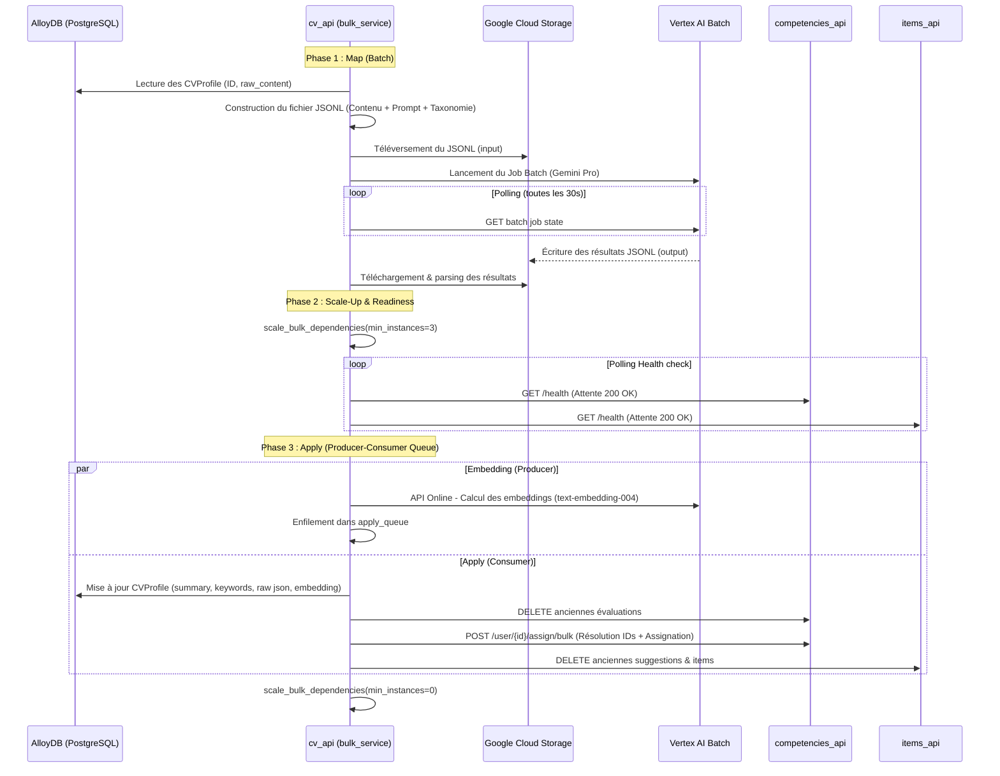
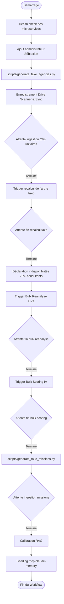

# 🧠 Analyses Critiques des Pipelines IA et Ingestion

Ce document détaille le fonctionnement, les points forts et les faiblesses techniques des trois composants clés du système de staffing IA :
1. Le pipeline d'ingestion et de ré-analyse de CVs en mode Bulk.
2. Le processus multi-étapes de recalcul de l'arbre taxonomique de compétences.
3. Le workflow d'orchestration de génération de données de démonstration GCP Summit.

---

## 1. Pipeline d'Ingestion & Ré-analyse CV en Bulk

### ⚙️ Architecture & Flux d'Exécution
Le service de ré-analyse en masse (`cv_api/src/services/bulk_service.py`) permet de retraiter tout ou partie des profils de CVs enregistrés en base. Il repose sur un pattern hybride combinant **Vertex AI Batch Prediction** pour l'extraction de données par LLM et des appels concurrents avec throttling pour la persistance et la synchronisation inter-services.



### ✅ Forces
- **Optimisation des coûts (FinOps)** : Le passage par Vertex AI Batch Prediction divise par deux le tarif d'inférence LLM par rapport à l'API synchrone en ligne.
- **Auto-Throttling & Back-pressure** : L'utilisation d'une queue asynchrone (`asyncio.Queue`) avec semaphores (`BULK_EMBED_SEMAPHORE` et `BULK_APPLY_SEMAPHORE`) empêche le service de saturer l'API Gemini ou d'écrouler la base de données.
- **Résilience inter-services** : Intégration d'un wrapper `_apply_with_retry` gérant intelligemment le backoff exponentiel et le jitter sur les codes `429` (surcharge transitoire) et `5xx`.
- **Readiness proactif** : Attente explicite que les instances scalées de `competencies_api` et `items_api` aient terminé leur cold start avant de lancer la phase d'écriture.

### ❌ Faiblesses & Améliorations
1. **Goulot d'étranglement de l'Embedding en ligne** : Contrairement à l'extraction LLM qui est batchée, le calcul d'embeddings se fait en ligne dans la queue. Si N > 1000 CVs, cela risque de saturer le quota d'API en direct et de ralentir l'étape d'Apply.
   * *Amélioration* : Inclure la génération d'embeddings dans un second job Vertex AI Batch avant la phase d'apply.
2. **Perte du score de fiabilité** : Pendant le bulk reanalyse, la similarité cosinus (score de fiabilité) n'est pas calculée et est forcée à `None`.
   * *Amélioration* : Calculer la similarité cosinus en Python localement après réception du vecteur d'embedding pour conserver cet indicateur de qualité.
3. **Pression sur le pool de connexions DB** : La concurrence de l'apply peut causer des blocages et timeouts de transactions SQL si la base AlloyDB n'est pas taillée pour absorber l'écriture massive.
4. **Pas de retry partiel de haut niveau** : Si la phase d'apply échoue pour 5 CVs sur 65, le statut global passe en `completed` avec des erreurs loggées. Il n'y a pas d'option pour relancer *uniquement* la phase d'Apply pour les identités en échec.

---

## 2. Recalcul de l'Arbre Taxonomique (Taxonomie de Compétences)

### ⚙️ Architecture & Flux d'Exécution
La génération de la taxonomie (`cv_api/src/services/taxonomy_batch_service.py`) structure l'arbre global des compétences (Piliers > Catégories > Compétences). Elle utilise une machine à états Redis en 5 étapes :

```
[Idle] 
  │  (Déclenchement POST /recalculate_tree)
  ▼
[map] ──► Vertex AI Batch : Regroupe les compétences existantes par paquets de 500
  │       et produit une première classification brute.
  ▼
[deduplicating] ──► Gemini Online : Fusionne les piliers issus du Map pour
  │                 conserver une liste de 12 piliers canoniques.
  ▼
[reduce] ──► Vertex AI Batch : Associe précisément chaque compétence brute
  │          de la DB aux piliers et catégories dédupliqués.
  ▼
[sweeping] ──► Gemini Online : Compare l'arbre réduit avec les compétences en DB.
  │            Ré-associe ou fusionne les compétences manquantes ou archivées.
  ▼
[completed] ──► Application finale de l'arbre et des fusions dans competencies_api (/bulk_tree).
```

### ✅ Forces
- **MapReduce appliqué aux Prompts** : Permet de traiter un dictionnaire de compétences de taille indéfinie sans saturer la fenêtre de contexte d'une unique requête LLM.
- **Préservation de l'intégrité (Compétences Archivées)** : Les compétences associées à des profils mais absentes de l'arbre final sont annotées `[ARCHIVÉ]` pour contraindre le LLM à les placer obligatoirement, évitant de casser les relations en base de données.
- **Sécurité Zero-Trust robuste** : Génération autonome de service-token à durée de vie étendue (90 min) pour éviter les coupures d'autorisation au milieu du pipeline asynchrone.

### ❌ Faiblesses & Améliorations
1. **Risque de blocage (State Machine Zombie)** : La machine à états repose sur Redis. Si l'instance `cv_api` redémarre pendant l'étape `deduplicating` ou `sweeping` (exécutées en tâche de fond asynchrone locale via `asyncio.create_task`), la tâche meurt et Redis reste figé sur `running` indéfiniment.
   * *Amélioration* : Utiliser des fonctions Cloud Tasks ou un scheduler persistant pour sécuriser les transitions intermédiaires au lieu de tâches `asyncio` en mémoire.
2. **Piliers Fantômes lors du Sweep** : Le LLM invente parfois des piliers inexistants dans l'arbre Reduce pour y assigner des compétences. Le code filtre ces piliers fantômes via fuzzy matching, mais si 100% du lot est filtré, la taxonomie est bloquée.
3. **Complexité du pipeline hybride** : Le mélange d'étapes Vertex Batch (lentes, asynchrones) et d'appels LLM en direct (rapides, synchrones) rend le monitoring complexe et allonge le temps global (parfois > 45 minutes).

---

## 3. Workflow de Génération des Données de Démo

### ⚙️ Architecture & Flux d'Exécution
Le script d'orchestration (`scripts/generate_gcp_summit_data.py`) prépare l'environnement de démo complet à partir d'une base vierge.



### ✅ Forces
- **Automatisation absolue** : Permet de monter une démonstration client complexe et réaliste (65 consultants, indisponibilités, missions RFPs, RAG calibré) en une seule commande.
- **Idempotence des étapes** : Chaque sous-fonction vérifie le statut du pipeline distant avant d'agir. Si le script s'arrête, il reprend là où il s'est arrêté sans repayer les coûts de Vertex AI.

### ❌ Faiblesses & Améliorations
1. **Monolithe de données statiques** : Plus de 1000 lignes de code correspondent à la variable `DEMO_MEMORIES` (mémoires Claude injectées). Cela surcharge inutilement le script.
   * *Amélioration* : Déporter l'ensemble des mémoires de test dans des fichiers JSON/JSONL dédiés sous `scripts/demo_memories/` et n'utiliser le script que pour charger ces fichiers.
2. **Sensibilité au réseau local** : Si la machine de développement perd la connexion ou se met en veille pendant les phases d'attente passive (qui totalisent 15 à 30 minutes), le script s'interrompt en local bien que les pipelines GCP continuent de tourner.
   * *Amélioration* : Créer un endpoint d'orchestration global côté backend (ex: dans un service d'ops) pour exécuter l'ensemble du workflow côté serveur via des background tasks Cloud Run robustes.
